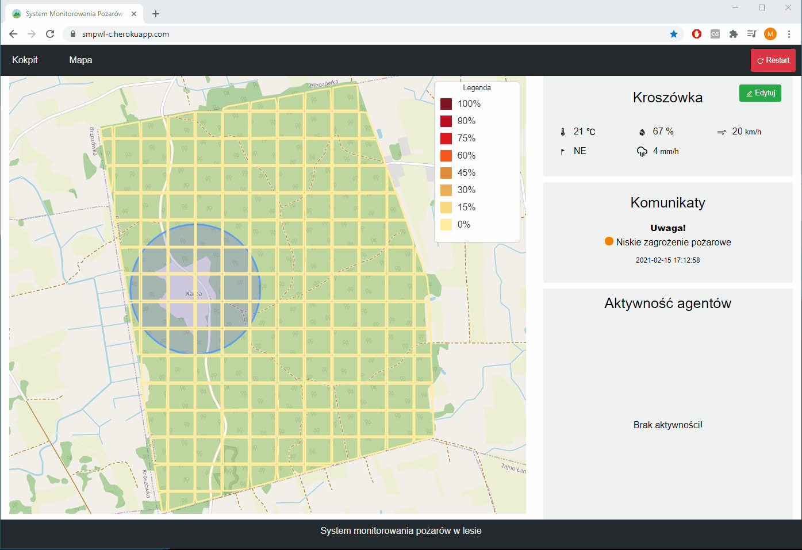

# System monitorowania pożarów w lesie
Projekt z inżynierii oprogramowania z prof. dr hab. inż. Radosławem Klimkiem.

## Podgląd

## Technologie
* React
* Node.js

## Autorzy
[Patryk Ptak](https://github.com/PatrykP99) |
[Mateusz Mądel](https://github.com/mateuszmadel) |
[Przemysław Kuca](https://github.com/EvilDamage) |
[Mateusz Janczak](https://github.com/mateuszjanczak)